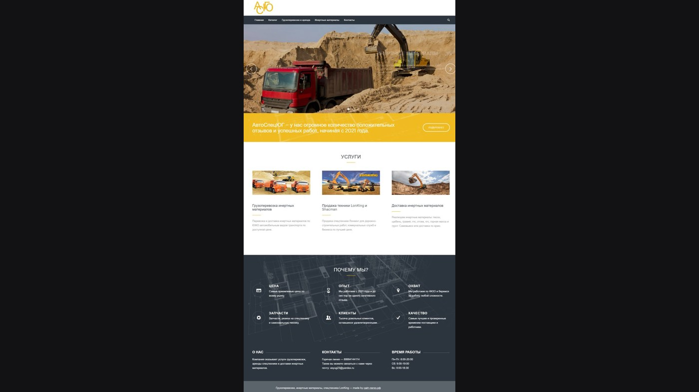

# 🏗️ Сайт ООО «АСЮГ»

  

АСЮГ — не «каталог экскаваторов» и не «магазин щебня». Это связка трёх направлений, которые на стройке обычно живут на разных сайтах: спецтехника, грузоперевозки и инертные материалы. Заказчику нужен цикл, а не три разные заявки.

## Три линии, один вход

- **Спецтехника** — карточки с характеристиками и фото, а не список «у нас есть самосвалы».
- **Перевозки** — заявка, ориентир по стоимости, разные типы грузов.
- **Материалы** — песок, щебень, гравий с объёмом и доставкой.

Сверху это ещё и «под ключ»: техника + материал + доставка, персональный менеджер. WordPress-проект, в репозитории — скриншоты и описание.

---

## 👨‍💻 Разработчик

*   **Лаврешин Илья Александрович**

---

## 📧 Контакты

По всем вопросам и предложениям вы можете написать на почту:  

