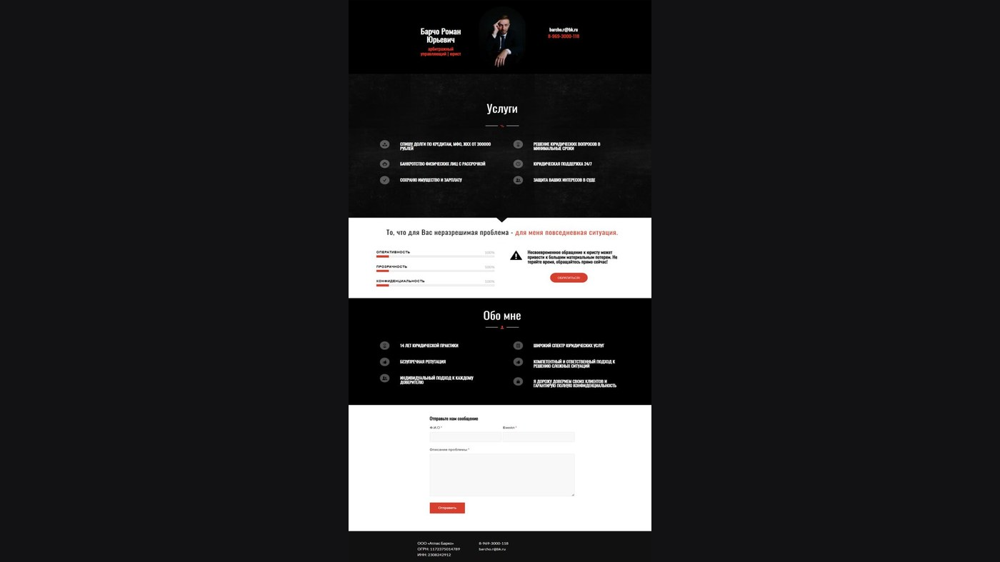

# ⚖️ Сайт ООО «Атлас Барчо»

  

Персональный сайт арбитражного управляющего. Не корпоративный портал «юридические услуги», а визитка конкретного человека с 20-летней практикой в банкротстве и финансовом оздоровлении.

Продакшен: [http://barcho.ru/](http://barcho.ru/)

## 🤝 Доверие важнее слогана

Здесь нет акций и форм «оставьте заявку на консультацию за 99 ₽». Опора — биография, сертификаты, карьера, сложные корпоративные дела. Сайт должен выглядеть спокойно и собранно: это профессия, где клиент выбирает человека, а не лендинг.

## 🛠️ На чём сделан

**WordPress**, индивидуальная тема под персональный бренд. Живой сайт: [barcho.ru](http://barcho.ru/). Код темы в репозиторий не выкладывался — по запросу.

## ✨ Что реализовано

- Цифровая визитка, а не каталог услуг с прайсом: биография, сертификаты, история карьеры.
- Акцент на экспертизу (банкротство, финансовое оздоровление, корпоративные споры), а не на «бесплатную консультацию».
- Спокойная адаптивная вёрстка: сайт должен читаться как документ специалиста, в том числе с телефона.

---

## 👨‍💻 Разработчик

*   **Лаврешин Илья Александрович**

---

## 📧 Контакты

По всем вопросам и предложениям вы можете написать на почту:  

