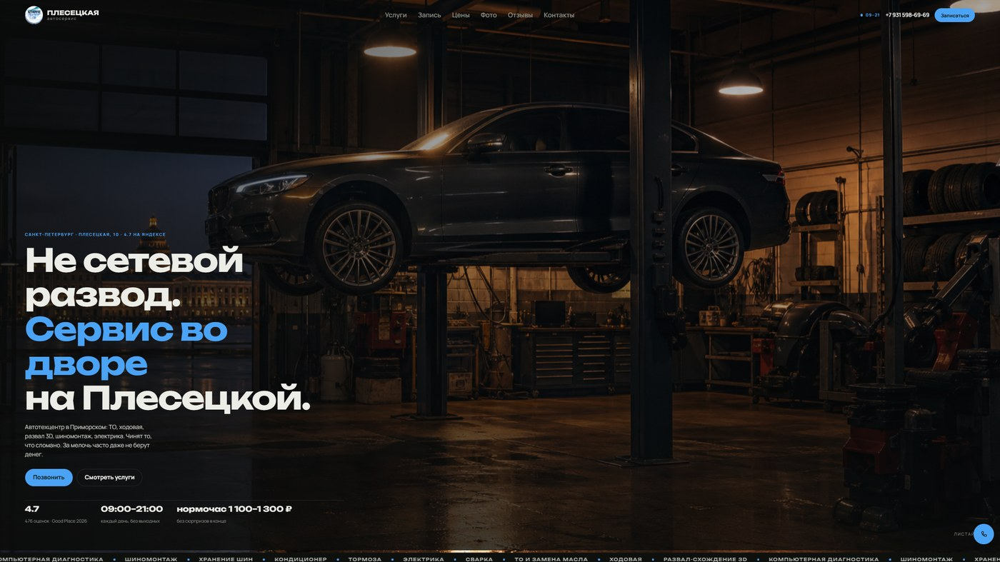

# 🔧 Автосервис «Плесецкая»

<p align="center">
  
</p>

Сайт для техцентра, который не притворяется сетью. Тон прямой: «оставил машину — и домой пешком», цены «от», диагноз до работы, без «а ещё вот это надо». Услуги — ТО, ходовая, развал-схождение 3D, шиномонтаж, диагностика. Рейтинг 4,7.

## 🔩 Почему он не похож на типичный сайт СТО

У большинства автосервисов на первом экране — стоковые фото ямы и кнопка «узнать стоимость». Здесь наоборот: двор, живые снимки бокса, FAQ без менеджерского тумана и схема визита. Задача не «продать комплекс», а снять страх развода.

На странице есть прайс со стартовыми суммами, отзывы своими словами и запись через звонок или WhatsApp.

## 🛠️ На чём сделан

Одностраничник на **HTML, CSS и JavaScript**, без CMS и фреймворков. Шрифты — Manrope и Unbounded. В разметке JSON-LD типа `AutoRepair`: часы, рейтинг, телефон, карта.

## ✨ Что реализовано

- Форма записи уходит сразу в **WhatsApp** с именем, телефоном и комментарием — без бэкенда и без «спасибо, мы перезвоним».
- Лайтбокс галереи бокса: клик по фото, закрытие по Escape и по клику на фон.
- FAQ и прайс «от» прямо на странице: гость видит вилку до звонка.
- Schema.org для поиска: поисковик понимает, что это автосервис, а не просто лендинг.

## 📁 Структура

```
├── full-website.png
├── readme-preview.jpg
└── code/
    ├── index.html
    ├── css/
    ├── js/
    └── images/
```

## 🚀 Локальный запуск

```bash
cd code
python -m http.server 8080
```

Откройте `http://localhost:8080` в браузере.

---

## 👨‍💻 Разработчик

*   **Лаврешин Илья Александрович**

---

## 📧 Контакты

По всем вопросам и предложениям вы можете написать на почту:  
[](mailto:ilyalav2323@gmail.com)
