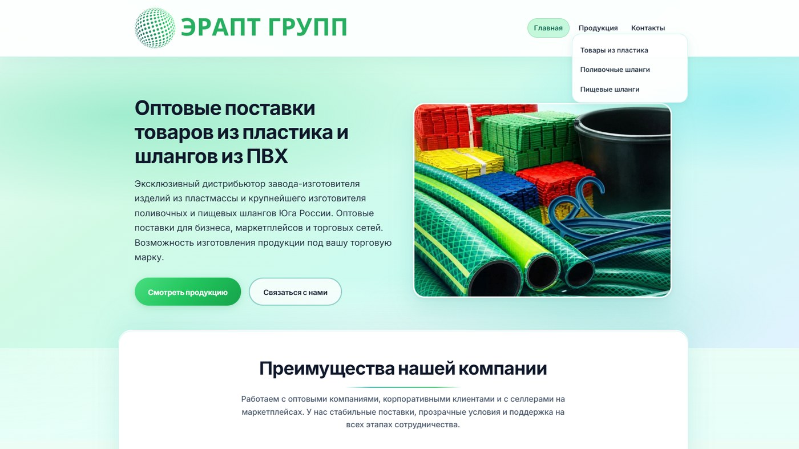

# 🏢 ЭРАПТ ГРУПП — корпоративный сайт

<p align="center">
  
</p>

Сайт компании **ООО «ЭРАПТ ГРУПП»**: оптовые поставки изделий из пластмассы, поливочных и пищевых шлангов из ПВХ.

Продакшен: [https://eraptgroup.ru/](https://eraptgroup.ru/)

Это не лендинг заведения и не WordPress-витрина. Здесь полноценный каталог на статическом HTML: три категории, карточка товара, варианты цвета, единый файл с данными. Менять ассортимент можно без CMS — добавил объект в `products-data.js`, и товар появляется в нужном разделе.

## На чём сделан

Мультистраничный сайт на **HTML, CSS и JavaScript**, без WordPress и без бэкенда. Шрифты Inter и Plus Jakarta Sans, иконки Font Awesome. Есть `sitemap.xml`, `robots.txt`, canonical и JSON-LD (`Organization`, `WebSite`, `ContactPage`). Продакшен крутится как обычная статика.

## Что реализовано

- Каталог из одного источника: `products-data.js` → сетка категории → страница `product.html?id=…`.
- У части товаров **варианты цвета** с другими фото и текстом; цвет пишется в URL.
- Слайдер на карточке, выпадающее мобильное меню, отдельные витрины пластика / полива / пищевых шлангов.
- Оптовый тон: реквизиты, ассортимент для сетей и маркетплейсов, а не витрина «купить ведро».

## 📋 О проекте

Сайт ориентирован на оптовых клиентов, маркетплейсы и торговые сети. Представлены три направления ассортимента:

- **Товары из пластика** — ведра, доски, черпаки, плитка, табуреты, сахарницы, вешалки и др.
- **Поливочные шланги** — линейки «Радуга», «Профессионал», «Метеор», «Мелисса» и другие.
- **Пищевые шланги** — позиции с учётом требований к материалам и маркировке.

## 📁 Структура репозитория

```
├── index.html              # Главная страница
├── products.html           # Обзор всех категорий
├── plastic-products.html   # Каталог: товары из пластика
├── watering-hoses.html     # Каталог: поливочные шланги
├── food-hoses.html         # Каталог: пищевые шланги
├── product.html            # Карточка товара (динамическая)
├── contact.html            # Контакты и реквизиты
├── css/
│   └── styles.css          # Общие стили
├── js/
│   ├── nav.js              # Мобильное меню и выпадающий список
│   ├── products-data.js    # Каталог товаров (единый источник данных)
│   ├── render-category-catalog.js  # Рендер сетки каталога по категории
│   └── product-detail.js   # Страница товара: слайдер, варианты цвета
├── image/                  # Логотип, фото товаров, баннеры
├── robots.txt
└── sitemap.xml
```

## 🚀 Локальный запуск

Файлы можно открыть напрямую в браузере, но для корректной работы относительных путей и поведения, близкого к продакшену, лучше поднять локальный сервер.

**Python:**

```bash
python -m http.server 8080
```

**Node.js (npx):**

```bash
npx serve .
```

После запуска откройте в браузере `http://localhost:8080` (или порт, который выведет `serve`).

## 🛒 Как устроен каталог

Все товары описаны в `js/products-data.js` в массиве `window.ERAPT_PRODUCTS`. Каждая запись содержит:

| Поле | Описание |
|------|----------|
| `id` | Уникальный идентификатор (используется в URL) |
| `category` | `plastic`, `watering` или `food` |
| `title` | Название на карточке и странице товара |
| `excerpt` | Краткое описание для каталога |
| `description` | Массив абзацев (строки или объекты `{ lead, sub, text }`) |
| `images` | Массив путей к фотографиям |
| `colorVariants` | Опционально: варианты цвета/размера с отдельными фото и описанием |
| `variantPickerLabel` | Подпись переключателя вариантов (по умолчанию «Цвет») |

Страницы категорий (`plastic-products.html`, `watering-hoses.html`, `food-hoses.html`) содержат контейнер с атрибутом `data-product-category`, скрипт `render-category-catalog.js` фильтрует товары и строит сетку карточек.

Карточка товара открывается по адресу:

```
product.html?id=<id>&color=<variant-id>
```

Параметр `color` необязателен и нужен для товаров с `colorVariants`.

### ➕ Добавление нового товара

1. Положите изображения в `image/items/…`.
2. Добавьте объект в массив `ERAPT_PRODUCTS` в `js/products-data.js`.
3. Убедитесь, что `category` совпадает с категорией на нужной странице каталога.
4. Проверьте карточку локально: каталог → страница товара → переключение вариантов (если есть).

## 🔍 SEO и метаданные

- На страницах заданы `title`, `description`, `canonical`, Open Graph–подобные поля и JSON-LD (`Organization`, `WebSite`, `ContactPage`).
- `sitemap.xml` и `robots.txt` указывают на домен `eraptgroup.ru`.
- При смене домена обновите canonical-ссылки в HTML, URL в `sitemap.xml` и `robots.txt`.

## 🔗 Внешние зависимости (CDN)

- [Google Fonts](https://fonts.google.com/) — Inter, Plus Jakarta Sans
- [Font Awesome 6](https://fontawesome.com/) — иконки на главной

Подключение идёт из HTML, для офлайн-работы можно скачать шрифты и иконки локально.

---

## 👨‍💻 Разработчик

*   **Лаврешин Илья Александрович**

---

## 📧 Контакты

По всем вопросам и предложениям вы можете написать на почту:  
[](mailto:ilyalav2323@gmail.com)
