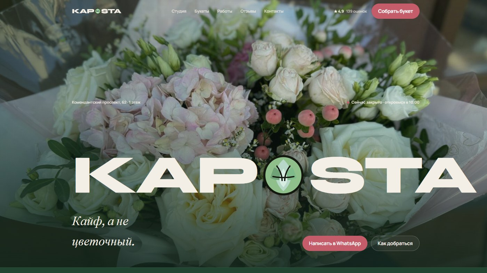

# 💐 Цветочная студия Kapusta

<p align="center">
  
</p>

## 🎯 О проекте

Сайт флористической студии **Kapusta**. Авторские букеты, композиции, свадебная флористика и комнатные растения. Рейтинг 4,9 на Яндексе, «Хорошее место 2026». Ежедневно 10:00–22:00.

### 💡 Основная идея
- «Кайф, а не цветочный» — живая студия, а не витрина вчерашних букетов
- Заказ по бюджету или «на глаз»
- Быстрая связь: звонок и WhatsApp

### ✅ Что есть на сайте
- О студии и подходе флористов
- Каталог букетов и направлений (повседневные, авторские, свадьба)
- Галерея реальных работ
- Отзывы гостей
- Мастер-классы в лофте
- Контакты, карта и CTA «Собрать букет»

### 📱 Адаптивность
- 💻 Десктоп: крупная флористическая подача и сетка работ
- 📱 Мобильная версия: каталог и WhatsApp в пару тапов
- 🖼️ Оптимизация фото букетов и студии

## 📁 Структура

```
├── full-website.png
└── code/
    ├── index.html
    ├── css/
    ├── js/
    └── images/
```

## 🚀 Локальный запуск

```bash
cd code
python -m http.server 8080
```

Откройте `http://localhost:8080` в браузере.

---

## 👨‍💻 Разработчик

*   **Лаврешин Илья Александрович**

---

## 📧 Контакты

По всем вопросам и предложениям вы можете написать на почту:  
[](mailto:ilyalav2323@gmail.com)
