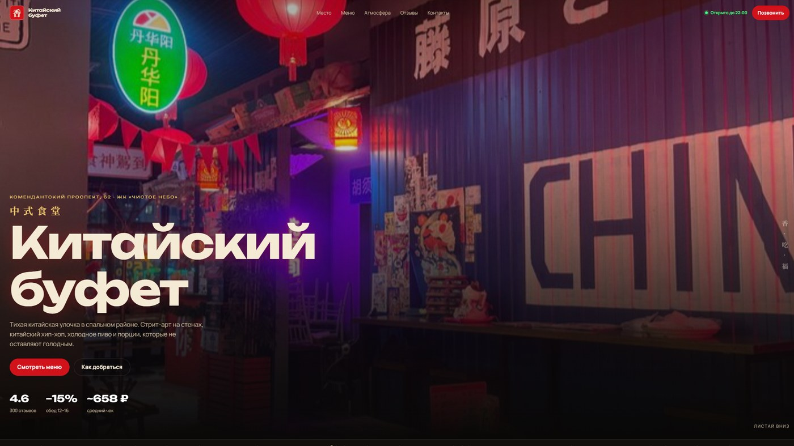

# 🍜 Китайский буфет

<p align="center">
  
</p>

## 🎯 О проекте

Сайт аутентичного китайского кафе. Стрит-арт, красные фонари, том ям, кисло-сладкая курица и холодное китайское пиво. Обед −15% с 12 до 16. Рейтинг 4,6.

### 💡 Основная идея
- Ощущение «тихой китайской улочки» на районе
- Большое меню с отдельными страницами блюд
- Быстрый звонок и понятный визит без онлайн-заказа

### ✅ Что есть на сайте
- Главная: место, атмосфера, акции, отзывы, контакты
- Каталог меню с карточками блюд
- Отдельные HTML-страницы позиций (`code/menu/`)
- Галерея зала и стрит-арта
- Статус «открыто / закрыто» и схема проезда
- Телефон для заказа и брони: +7 (812) 628-68-88

### 📱 Адаптивность
- 💻 Десктоп: витрина блюд и атмосфера зала
- 📱 Мобильная версия: меню и звонок в один тап
- 🖼️ Оптимизация фото еды и интерьера

## 📁 Структура

```
├── full-website.png
└── code/
    ├── index.html          # Главная
    ├── menu/               # Страницы отдельных блюд
    ├── css/
    ├── js/                 # В т.ч. данные меню
    └── images/
```

## 🚀 Локальный запуск

```bash
cd code
python -m http.server 8080
```

Откройте `http://localhost:8080` в браузере.

---

## 👨‍💻 Разработчик

*   **Лаврешин Илья Александрович**

---

## 📧 Контакты

По всем вопросам и предложениям вы можете написать на почту:  
[](mailto:ilyalav2323@gmail.com)
