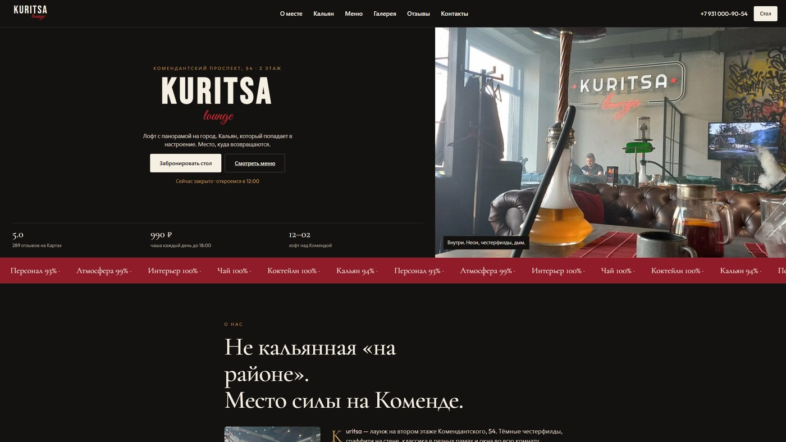

# 💨 Кальян-бар Kuritsa

<p align="center">
  
</p>

Kuritsa — ночной лофт, а не «кальянная на районе». Сайт держит этот тон: неон, честерфилды, панорама, кальян «который попадает в настроение». Рейтинг 5,0. Днём — чаша за 990 ₽, вечером место, куда остаются до трёх.

## Что здесь вместо обычного меню-лендинга

Первый экран сам говорит, открыто ли заведение. Дальше — карта кальяна, кухня, чай, коктейли и модальное окно брони стола. Галерея не «фото еды с фотобанка», а то, как это выглядит, когда ты уже внутри.

## 📁 Структура

```
├── full-website.png
├── readme-preview.jpg
└── code/
    ├── index.html
    ├── css/
    ├── js/
    └── images/
```

## 🚀 Локальный запуск

```bash
cd code
python -m http.server 8080
```

Откройте `http://localhost:8080` в браузере.

---

## 👨‍💻 Разработчик

*   **Лаврешин Илья Александрович**

---

## 📧 Контакты

По всем вопросам и предложениям вы можете написать на почту:  
[](mailto:ilyalav2323@gmail.com)
