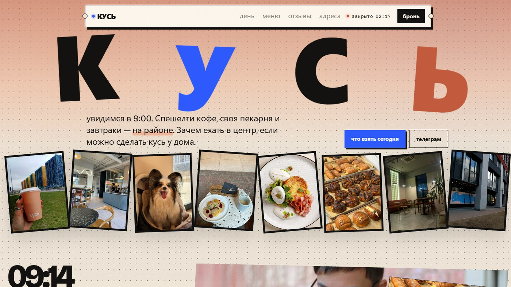

# ☕ Сеть кофеен «Кусь»

<p align="center">
  
</p>

Спешелти-кофе «на районе»: своя пекарня, завтраки до 15:00 и несколько точек с одним вайбом. Название — глагол. Сайт говорит так же коротко: «подожди секунду», «кофе уже на столе», «кусь».

## 🐕 Меню для хвостов

Кроме кофе и выпечки на сайте есть отдельный блок «можно с хвостом» — блюда для собак. Это не шутка в подвале, а часть бренда. Навигация сделана как билет, приветствие на первом экране меняется по времени суток, а буква «ь» в логотипе будто откушена.

Три точки, статус открытия, Telegram и бронь.

## 🛠️ На чём сделан

Одностраничник **HTML / CSS / JS** (`app.js`). Шрифты Bricolage Grotesque, IBM Plex Mono и Gochi Hand. Меню, отзывы и «сцены дня» лежат в данных внутри скрипта — страница собирает карточки сама.

## ✨ Что реализовано

- Приветствие и состав меню зависят от часа: утром «доброе утро» и завтраки, после 15:00 — паста и щечки.
- Блок «день» крутится со скроллом: шесть сцен от 09:14 до 21:10, как сторис про кофейню.
- Меню для собак — отдельная полка, не сноска.
- Клик по логотипу — всплывающее «кусь!»; кастомный курсор и «хвостик», который догоняет мышь.
- Заметки-отзывы на «столе» можно подвигать пальцем или мышью.
- Навигация-билет подсвечивает текущий раздел при скролле.

## 📁 Структура

```
├── full-website.png
├── readme-preview.jpg
└── code/
    ├── index.html
    ├── css/
    ├── js/
    └── images/
```

## 🚀 Локальный запуск

```bash
cd code
python -m http.server 8080
```

Откройте `http://localhost:8080` в браузере.

---

## 👨‍💻 Разработчик

*   **Лаврешин Илья Александрович**

---

## 📧 Контакты

По всем вопросам и предложениям вы можете написать на почту:  
[](mailto:ilyalav2323@gmail.com)
