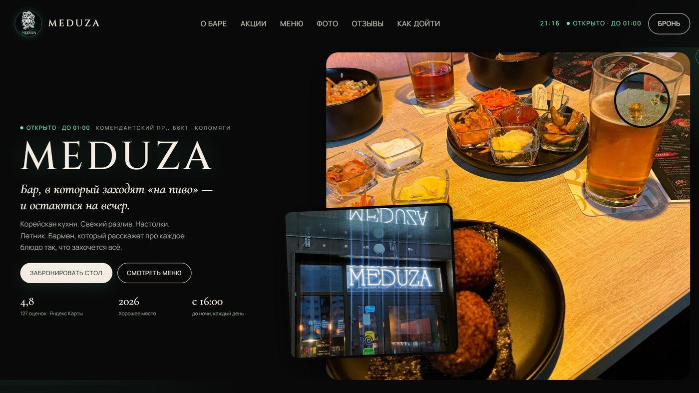

# 🪼 Паб-бар Meduza

<p align="center">
  
</p>

Пиво, кимчи, настолки, летняя веранда. Meduza — бар, в который возвращаются, а не «гастропаб с концепцией». Рейтинг 4,8, отметка «Хорошее место 2026».

## Темнота, курсор и часы

Сайт не пытается быть светлым и «аппетитным». Тёмный холст, шум, подсветка, свой курсор, часы по Москве и живой статус «открыто / закрыто». Меню держит две линии сразу: пиво и корейская кухня — это и есть характер зала, а не случайный микс.

Бронь — звонок. Фотографии зала и веранды лежат в `code/assets/`.

## 📁 Структура

```
├── full-website.png
├── readme-preview.jpg
└── code/
    ├── index.html
    ├── css/
    ├── js/
    └── assets/            # Логотип, фото еды и зала
```

## 🚀 Локальный запуск

```bash
cd code
python -m http.server 8080
```

Откройте `http://localhost:8080` в браузере.

---

## 👨‍💻 Разработчик

*   **Лаврешин Илья Александрович**

---

## 📧 Контакты

По всем вопросам и предложениям вы можете написать на почту:  
[](mailto:ilyalav2323@gmail.com)
