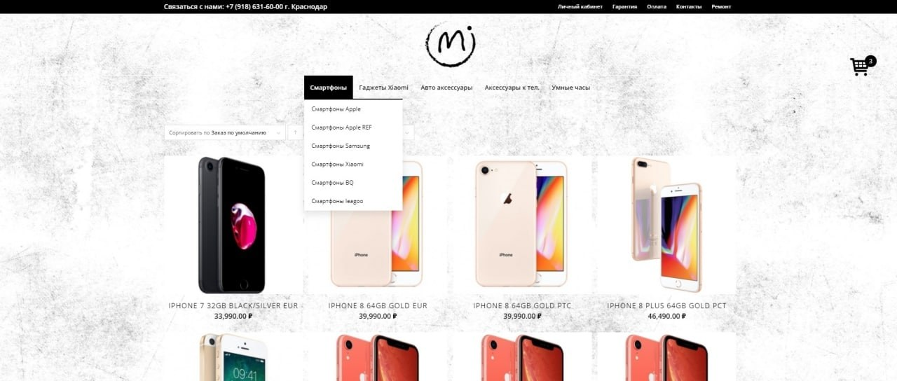

# 📱 Сайт «MMobile»

  

Интернет-магазин техники: смартфоны, планшеты, гаджеты. Не витрина «наши товары», а цикл покупки — от фильтра до оплаты и статуса заказа.

## Сравнение важнее баннера

Главное, чем сайт отличается от простых карточек в Instagram: умные фильтры, таблица сравнения моделей, отзывы, гарантия и личный кабинет. Человек выбирает устройство по характеристикам, а не по картинке.

## На чём сделан

**WordPress** с магазином: каталог, карточки товаров, оформление заказа. Кастомная тема под электронику. В репозитории — превью главной, код темы по запросу.

## Что реализовано

- Полноценный цикл покупки: каталог → фильтры (бренд, цена, характеристики) → сравнение моделей → корзина и оплата.
- Карточки с характеристиками, отзывами и статусом заказа в личном кабинете.
- Мобильная версия заточена под быстрый заказ с телефона, а не «ужатая десктоп-сетка».

---

## 👨‍💻 Разработчик

*   **Лаврешин Илья Александрович**

---

## 📧 Контакты

По всем вопросам и предложениям вы можете написать на почту:  

