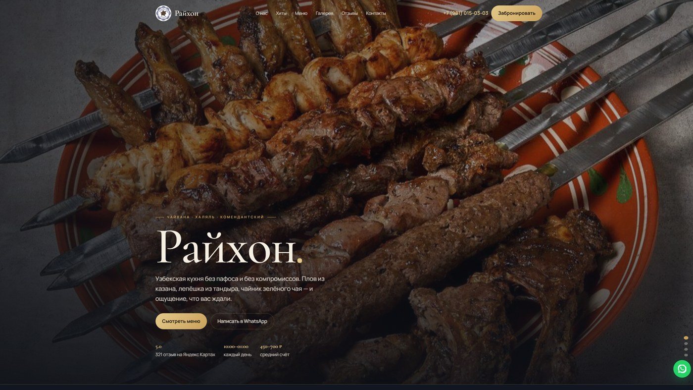

# 🫖 Чайхона «Райхон»

<p align="center">
  
</p>

Узбекская кухня без пафоса: плов из казана, лепёшка из тандыра, манты, лагман, шашлык. Халяль. Рейтинг 5,0. Средний счёт спокойный, порции большие, кухня работает до часа ночи.

## 🍽️ Ощущение, что стол уже накрыт

Сайт не продаёт «гастрономический опыт». Он встречает как чайхана: тёплое золото, слайдер с пловом и шашлыком, хиты отдельно от полного меню, бронь в пару кликов. Задача — чтобы гость пришёл голодным, а не изучал бренд.

## 🛠️ На чём сделан

Одностраничник **HTML / CSS / JS**. Шрифты Cormorant Garamond и Manrope. JSON-LD ресторана. Без бэкенда: бронь уходит в WhatsApp.

## ✨ Что реализовано

- Слайдер на первом экране: блюда и интерьер меняются сами каждые несколько секунд.
- Полное меню с фильтрами по категориям (хиты отдельно, остальное — вкладками).
- Модалка брони: дата, время, число гостей → готовый текст в WhatsApp и подтверждение на странице.
- Лайтбокс галереи, «показать ещё» в фотозалах, карусель отзывов.
- Появление секций при скролле, фиксация шапки.

## 📁 Структура

```
├── full-website.png
├── readme-preview.jpg
└── code/
    ├── index.html
    ├── css/
    ├── js/
    └── images/
```

## 🚀 Локальный запуск

```bash
cd code
python -m http.server 8080
```

Откройте `http://localhost:8080` в браузере.

---

## 👨‍💻 Разработчик

*   **Лаврешин Илья Александрович**

---

## 📧 Контакты

По всем вопросам и предложениям вы можете написать на почту:  
[](mailto:ilyalav2323@gmail.com)
