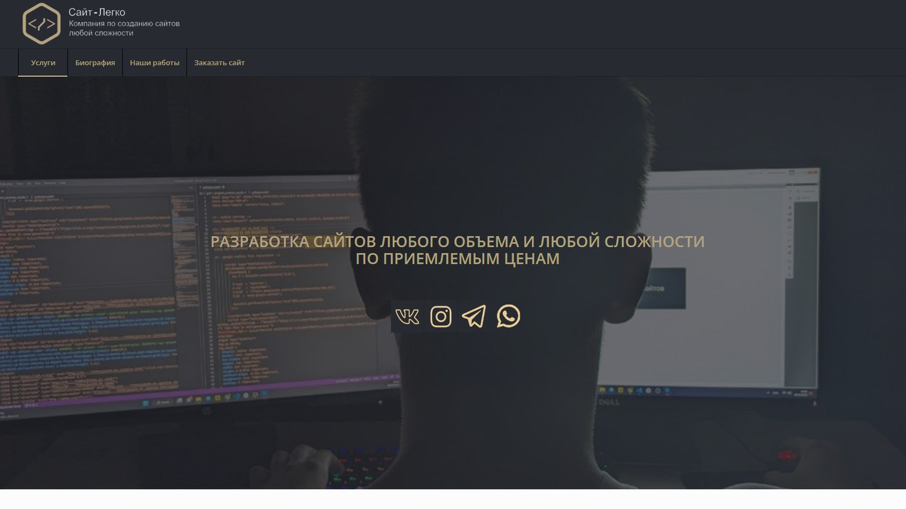

# 🌐 Сайт-портфолио веб-разработчика

  

## 📋 О проекте

Это личный сайт-портфолио и лендинг для привлечения клиентов. Сайт выполняет роль цифровой визитной карточки, наглядно демонстрирующей мои навыки в веб-разработке и дизайне. Основная цель — конверсия посетителей в заказчиков через представление услуг, портфолио и упрощенные каналы связи.

**Ключевая концепция:** Минимализм, ясность, акцент на контент и призывы к действию.

---

## ✨ Функционал и особенности

- **🗂️ Презентация услуг:** Четкое структурированное описание предлагаемых услуг по разработке.
- **🎨 Интерактивное портфолио:** Галерея реализованных проектов с описанием технологий и ссылками.
- **📞 Мгновенная связь:** Виджеты и кнопки для связи через Telegram, WhatsApp, прямой звонок.
- **📝 Форма заявки:** Встроенная форма для отправки запроса на оценку проекта.
- **📱 Полная адаптивность:** Идеальное отображение на всех устройствах (Desktop, Tablet, Mobile).
- **⚡ Оптимизация:** Быстрая загрузка страниц за счет оптимизированных ресурсов.

---

## 👨‍💻 Разработчик

*   **Лаврешин Илья Александрович**

---

## 📧 Контакты

По всем вопросам и предложениям вы можете написать на почту:  

