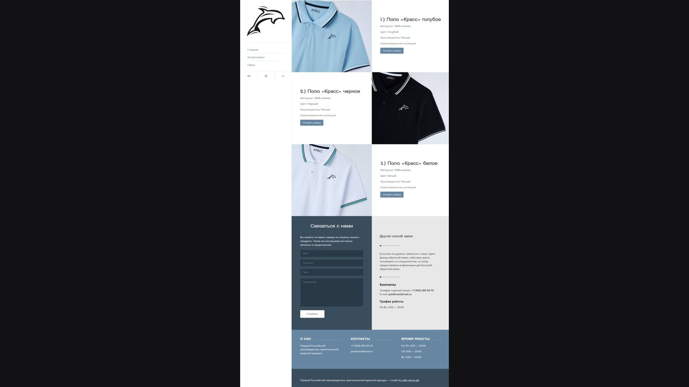

# 👕 Сайт "SHOP КРАСС"

  

## 🎯 О проекте

**SHOP КРАСС** — презентационная платформа бренда одежды из Краснодара. Сайт демонстрирует коллекции футболок и polo, но не поддерживает онлайн-покупки. Основная цель — знакомство с брендом и сбор заявок от потенциальных клиентов.

### 💡 Основная идея
- **Демонстрация** товаров и философии бренда
- **Привлечение** интереса к продукции КРАСС
- **Сбор контактов** заинтересованных клиентов
- **Создание** имиджа премиального бренда

### ✅ Что можно делать на сайте:
- Просматривать полный каталог товаров
- Изучать детали продукции (состав, размеры)
- Оставлять заявку на обратный звонок
- Знакомиться с историей бренда
- Смотреть фото продукции в разных ракурсах

### 📱 Адаптивность
- 💻 **Десктоп:** полная визуальная презентация
- 📱 **Мобильная версия:** упрощенная навигация
- 🖼️ **Оптимизация изображений:** быстрая загрузка фото

---

## 👨‍💻 Разработчик

*   **Лаврешин Илья Александрович**

---

## 📧 Контакты

По всем вопросам и предложениям вы можете написать на почту:  

