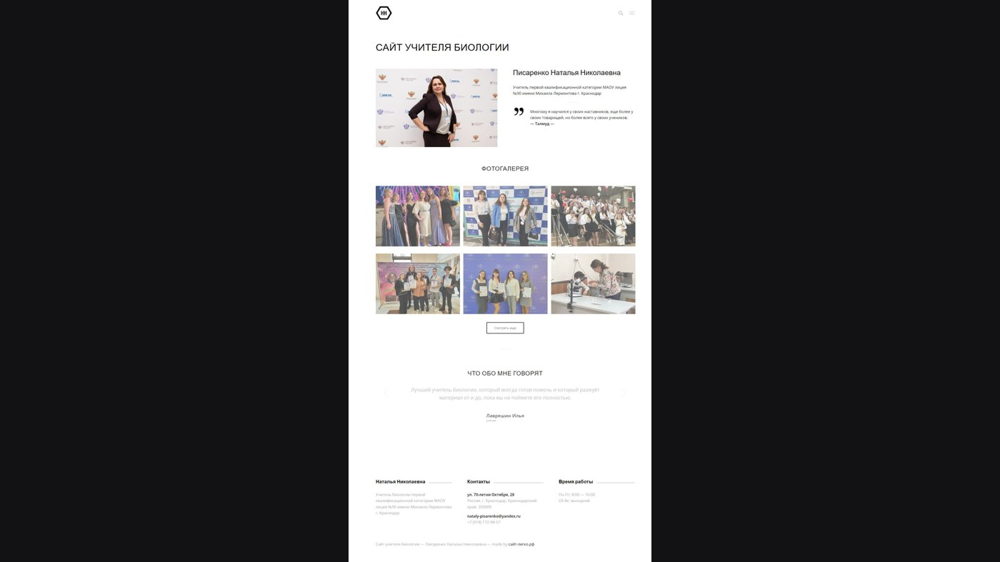

# 🌿 Сайт «Учитель биологии»

  

Персональный сайт педагога, а не школы и не репетиторской платформы. Здесь методички, авторские материалы и фото живой природы — то, чем учитель делится сам.

## Кабинет, открытый наружу

Нет каталога курсов и кнопки «записаться на ЕГЭ». Есть разработки уроков, награды, стаж и галерея. Сайт для коллег, учеников и родителей, которым важно увидеть человека за предметом.

## На чём сделан

**WordPress**, персональная тема под образовательный блог-визитку. В папке — скриншоты главной, галереи и контактов.

## Что реализовано

- Разделы под методички, авторские материалы и фото природы — контент педагога, не лендинг репетитора.
- Галерея и блок достижений: сайт как портфолио учителя, а не как продажа курсов.
- Контакты и адаптив, чтобы материалы открывались с телефона так же спокойно, как с компьютера.

---

## 👨‍💻 Разработчик

*   **Лаврешин Илья Александрович**

---

## 📧 Контакты

По всем вопросам и предложениям вы можете написать на почту:  

