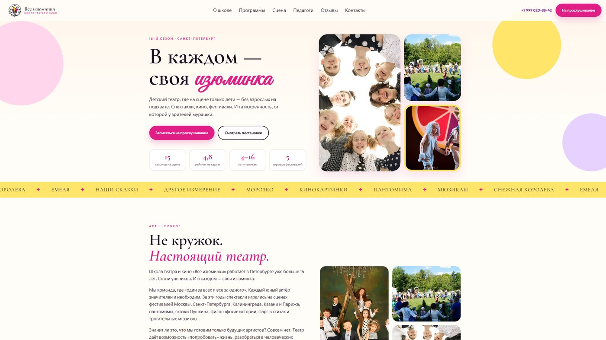

# 🎭 Школа театра и кино «Все изюминки»

<p align="center">
  
</p>

Детская школа театра и кино, а не кружок по субботам. 15 сезонов, спектакли от Петербурга до Парижа, дети 4–16 лет. Девиз: в каждом — своя изюминка. Рейтинг 4,8.

## 🎬 Сцена вместо прайса «занятие 45 минут»

Страница собрана как театральная программа: акты, педагоги, закулисье, живые фото постановок. Программы разные — подготовительная группа, средняя и старшая, продвинутый уровень, киноклуб, вокал. Главный следующий шаг не «купить абонемент», а прийти на прослушивание.

Это не HoReCa-лендинг из той же серии: здесь другой ритм, другая типографика и другая цель.

## 🛠️ На чём сделан

Одностраничник **HTML / CSS / JS**. Шрифты Cormorant Garamond, Great Vibes и Outfit — театральная пара «антиква + рукопись». JSON-LD `EducationalOrganization`.

## ✨ Что реализовано

- Форма на прослушивание: имя, телефон, ребёнок, программа. Заявка копируется в буфер и помечается как отправленная — без сервера.
- Программы как отдельные карточки: возраст, часы, цена, киноклуб и вокал рядом со сценой.
- Лайтбокс закулисья и спектаклей, прелоадер с логотипом школы.
- Композиция «по актам», а не стандартные «о нас / услуги / контакты».

## 📁 Структура

```
├── full-website.png
├── readme-preview.jpg
└── code/
    ├── index.html
    ├── css/
    ├── js/
    └── images/
```

## 🚀 Локальный запуск

```bash
cd code
python -m http.server 8080
```

Откройте `http://localhost:8080` в браузере.

---

## 👨‍💻 Разработчик

*   **Лаврешин Илья Александрович**

---

## 📧 Контакты

По всем вопросам и предложениям вы можете написать на почту:  
[](mailto:ilyalav2323@gmail.com)
