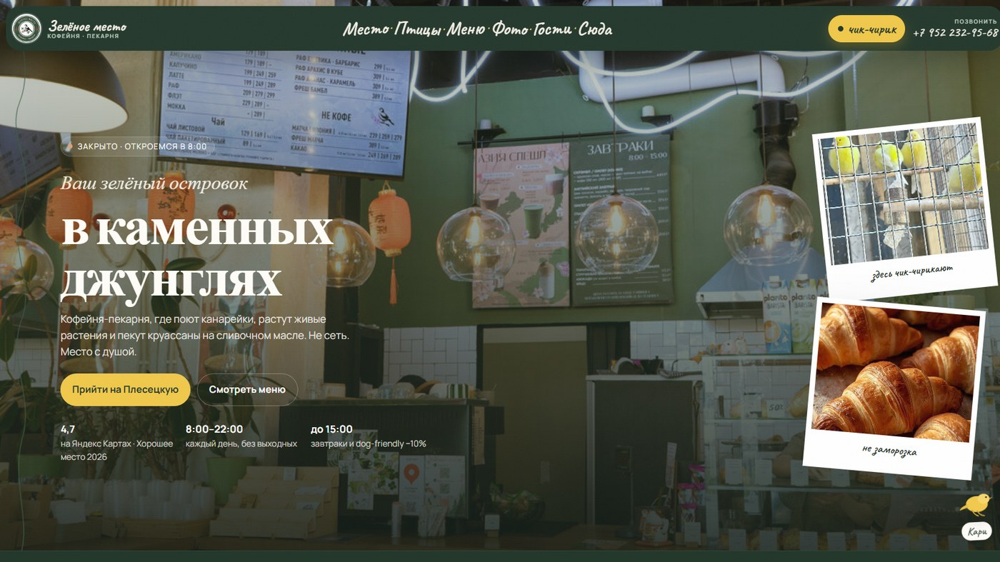

# 🌱 Кофейня-пекарня «Зелёное место»

<p align="center">
  
</p>

Кофейня-пекарня с живыми растениями и канарейками — отсюда и тон сайта: виноградные лозы по краям, тёплая «ботаническая» вёрстка, круассаны, авторский кофе. Место ещё зовут Green Place и «Чик-Чирик». Рейтинг 4,7.

## Кари поёт

На странице есть канарейка Кари. Если нажать — она чирикает: звук собран на Web Audio API, без готового mp3. Это не пасхалка ради пасхалки, а характер места, перенесённый в интерфейс.

Есть меню выпечки и завтраков, галерея зала и мерча, Telegram.

## На чём сделан

Одностраничник **HTML / CSS / JS**. Шрифты Caveat, Fraunces и Manrope. Звук канарейки — **Web Audio API**, без mp3. JSON-LD `CafeOrCoffeeShop`. Часы считаются по Москве.

## Что реализовано

- Кари чирикает по клику: осциллятор, фильтр, своя «песенка» из нескольких нот. Можно включить фоновый чирик.
- Прелоадер «чик → чик-чирик → добро пожаловать».
- Меню на вкладках: кофе, выпечка, завтраки.
- Галерея с «смотреть ещё» и лайтбоксом.
- Статус открытия 8:00–22:00 по европейскому/московскому времени.

## 📁 Структура

```
├── full-website.png
├── readme-preview.jpg
└── code/
    ├── index.html
    ├── css/
    ├── js/
    └── images/
```

## 🚀 Локальный запуск

```bash
cd code
python -m http.server 8080
```

Откройте `http://localhost:8080` в браузере.

---

## 👨‍💻 Разработчик

*   **Лаврешин Илья Александрович**

---

## 📧 Контакты

По всем вопросам и предложениям вы можете написать на почту:  
[](mailto:ilyalav2323@gmail.com)
